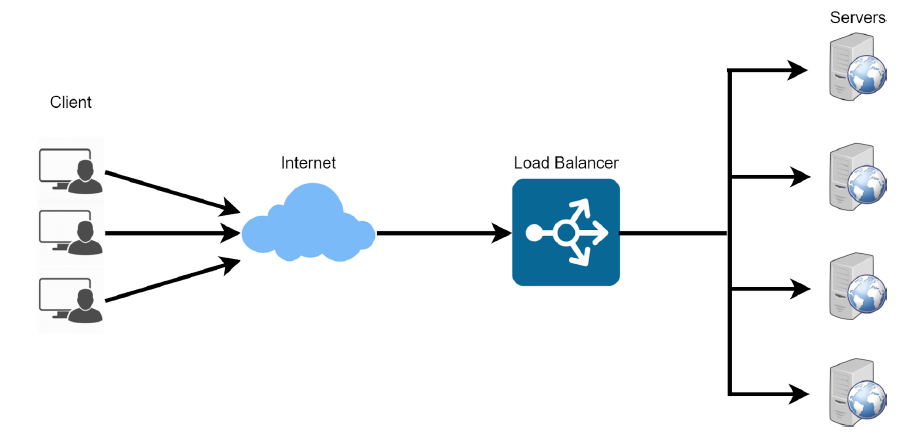
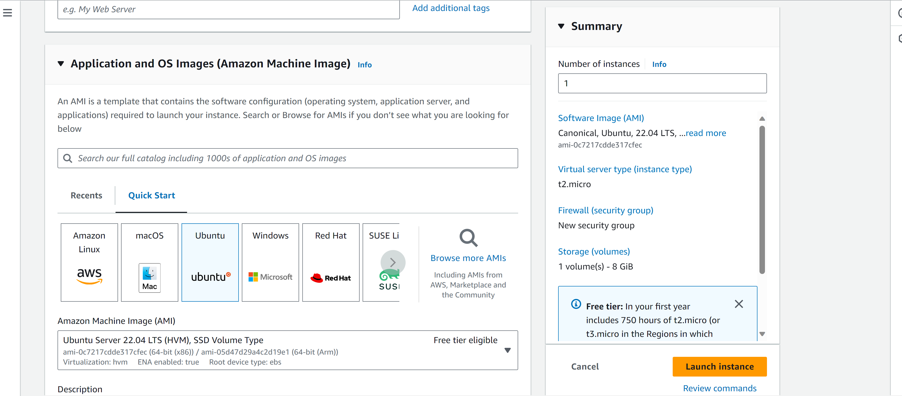
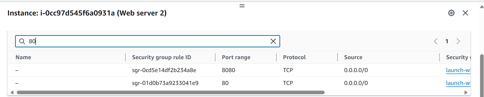
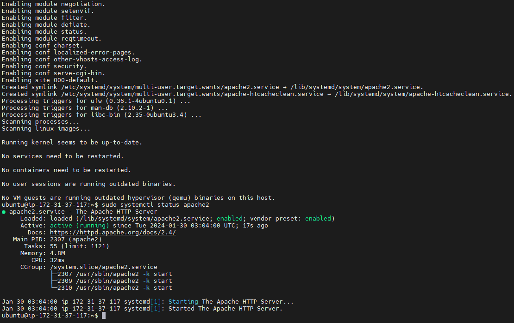
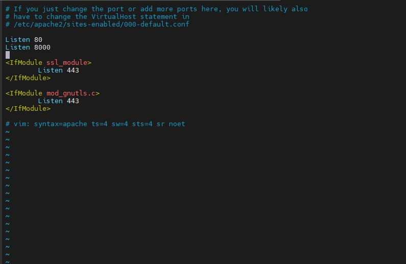
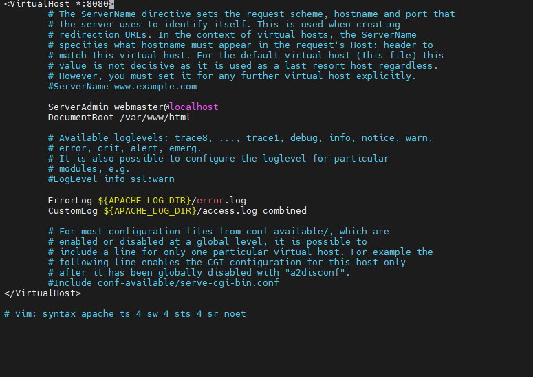
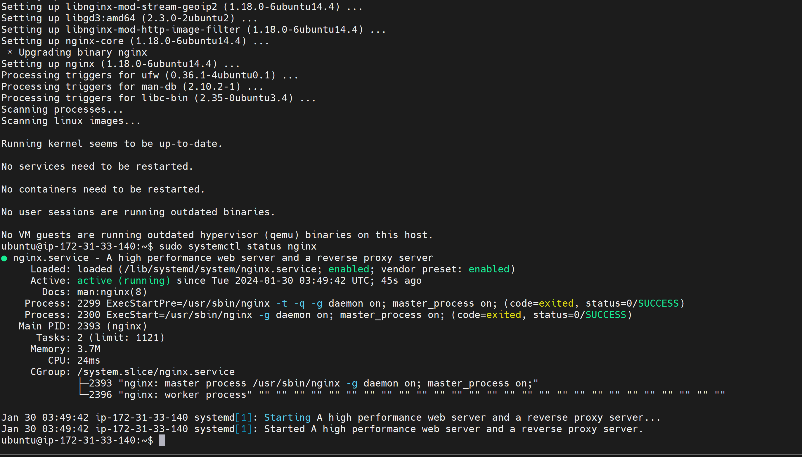
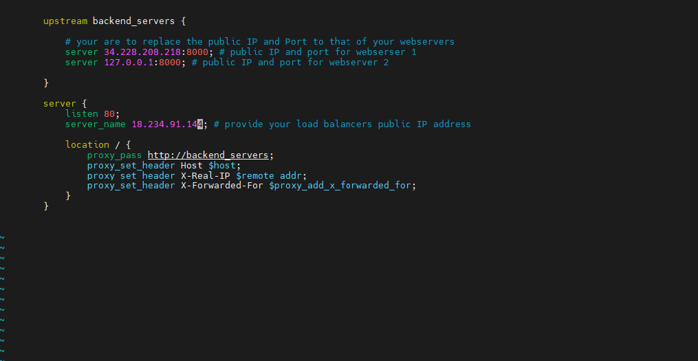
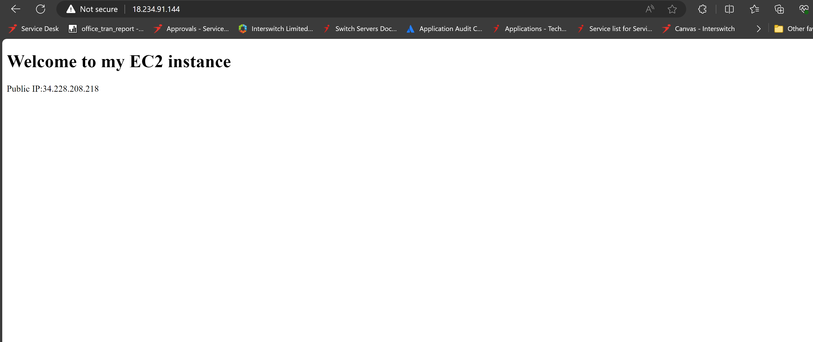

"# Loadbalancers-with-NGINX" 

#   Implementing Loadblancers with Nginx

Discover the art of load balancing with Nginx in this project. Learn how to distribute traffic efficiently across multiple servers, optimize performance, and ensure high availability for your web applications

Introduction to Load Balancing and Nginx



Load balancing can be likened to a coordinated effort where multiple individuals come together to efficiently complete a substantial task. Consider the scenario where you're faced with the challenge of moving numerous heavy boxes, a task too daunting for a single person due to the sheer weight.

This is where load balancing comes into play, akin to enlisting the help of friends to share the burden. Each friend takes on a portion of the boxes, ensuring they are transported to their intended destination. The collective effort significantly hastens the process, thanks to the collaborative endeavor.

In the realm of computing, load balancing refers to the distribution of tasks or computational loads across multiple computers or servers. This strategy prevents any single machine from being overwhelmed by excessive demands. It ensures the seamless operation of digital services, guaranteeing that websites and applications remain responsive and efficient. Essentially, it embodies the principle of teamwork within the digital infrastructure.

For instance, consider a scenario with multiple web servers hosting a website. To evenly distribute incoming traffic among these servers, a load balancer is implemented. Positioned at the forefront of the web servers, the load balancer receives all incoming traffic and allocates it across the servers. This arrangement prevents any server from being overburdened, thereby enhancing the overall system performance.

Nginx stands out for its versatility, capable of functioning as a web server, reverse proxy, and load balancer, among other roles. The key lies in its configuration, which can be tailored to meet specific requirements.

In this project, we will guide you through configuring Nginx to serve as a load balancer, demonstrating its capability to streamline traffic flow and optimize server workload.

#   Setting Up a Basic Load Balancer
### Setting Up a Basic Load Balancer

We will be setting up two EC2 instances that operate on Ubuntu 22.04 and configuring them with the Apache web server. We will adjust their settings to accept traffic through port 8000 from any location and modify the default webpage to showcase their respective public IP addresses.

Following that, we will initiate a separate EC2 instance also on Ubuntu 22.04, but this one will have Nginx installed and set up to function as a load balancer, efficiently directing traffic to the Apache web servers.

**Step 1**: Launching an EC2 Instance

Begin by navigating to your AWS Management Console and selecting EC2. Scroll down and click on "Launch instance." In the "Name" field, assign a distinctive name for each of your web servers.



**Step 2**: Configuring Port 8000

Our Apache web servers will operate on port 8000, whereas the Nginx load balancer will utilize port 80. To facilitate unrestricted access to the web servers, it's essential to configure port 8000 to accept traffic from all sources. This adjustment involves adding a new rule to the security group associated with each web server instance.

To accomplish this, locate and click on the instance ID of your EC2 instance to view its detailed information.



Step 3: Setting Up Apache Web Server

With both servers provisioned and the requisite ports opened, the next step is to install the Apache web server software on each server. To achieve this, we need to establish an SSH connection to each web server. Once connected, we will be able to execute the necessary commands on each server's terminal.

Connecting to the Web Server:

To initiate a connection to your web server:

Click on the Instance ID of your EC2 instance to access its details.
At the top of the details page, you will find a "Connect" button. Click on it to proceed with establishing an SSH connection.

Open a terminal in your local machine, cd into your Downloads folder. Paste the ssh command you copied in the previous step
Click on enter and type yes when prompted. You should be connected to a terminal on your instance.

Next install apache with the command below

```bash
sudo apt update -y && sudo apt install apache2 -y
```

Verify that apache is running using the command below

```bash
sudo systemctl status apache2
```



**Step 4**:In this step, we will adjust the Apache web server configuration to serve content on port 8000 instead of the default port 80. After that, we will create a new index.html file designed to display the public IP address of the EC2 instance. This new file will replace the default Apache web server's homepage.

### Configuring Apache to Serve Content on Port 8000:

Edit Ports Configuration:
Access the Apache configuration file that specifies the listening ports by using a text editor like vi or nano. You might need to use sudo to edit this file if you don't have root privileges

```markdown
sudo vi /etc/apache2/ports.conf
```

Inside this file, locate the line that reads Listen 80 and either modify it to Listen 8000 or add a new line with Listen 8000 to keep Apache listening on both ports. Save and exit the editor.

Save your changes and exit the text editor.




Adjust Virtual Host Settings:

Next, you will need to update the virtual host file for Apache to ensure it serves requests on the new port. Open the default virtual host file, typically found at /etc/apache2/sites-available/000-default.conf, and modify the <VirtualHost *:80> line to <VirtualHost *:8000>:

```bash
sudo nano /etc/apache2/sites-available/000-default.conf
```



Save your changes and exit the text editor.

Restart apache to load the new configuration using the command below


```bash
sudo systemctl restart apache2
```

**Create a Custom Index.html:**

Navigate to the web server's root directory, usually /var/www/html/, and create or edit the index.html file:

```bash
sudo vi index.html
```

Switch vi editor to insert mode and paste the html fi le below. Before pasting the html fi le, get the public IP ofyour EC2 instance from AWS Management Console and replace the placeholder text for IP address in thehtml file.
```bash


        <!DOCTYPE html>
        <html>
        <head>
            <title>My EC2 Instance</title>
        </head>
        <body>
            <h1>Welcome to my EC2 instance</h1>
            <p>Public IP: YOUR_PUBLIC_IP</p>
        </body>
        </html>


```

Change file ownership of the index.html file with the command below:

```bash
sudo chown www-data:www-data ./index.html
```

Overriding the Default html file of Apache Webserver:
1.Replace the default html file with our new html file using the command below:

```bash
sudo cp -f ./index.html /var/www/html/index.html
```

2.Restart the webserver to load the new configuration using the command below:

```bash
sudo systemctl restart apache2
```


Step 5: Setting Up Nginx as a Load Balancer

In this step, you will configure Nginx to act as a load balancer, distributing incoming traffic evenly across your previously set up Apache web server.

Provisioning the Nginx Load Balancer EC2 Instance
Launch a New EC2 Instance:

Choose an EC2 instance running Ubuntu 22.04.
During the setup process, ensure that port 80 is open to accept traffic from any source in the instance's security group settings.
SSH into Your New EC2 Instance:

Once the instance is up and running, SSH into it as you did with the Apache server. The general command will look like this:

Install Nginx into the instance using the command and Verify that Nginx is installed with the command below:

```bash
sudo apt update -y && sudo apt install nginx -y

sudo systemctl status nginx
```



Open Nginx confi guration file with the command below:

sudo vi /etc/nginx/conf.d/loadbalancer.conf


Paste the confi guration file below to confi gure nginx to act like a load balancer. A screenshot of an example config file is shown below: Make sure you edit the file and provide necessary information like your server IP address etc.


```bash

        
        upstream backend_servers {

            # your are to replace the public IP and Port to that of your webservers
            server 127.0.0.1:8000; # public IP and port for webserser 1
            server 127.0.0.1:8000; # public IP and port for webserver 2

        }

        server {
            listen 80;
            server_name <your load balancer's public IP addres>; # provide your load balancers public IP address

            location / {
                proxy_pass http://backend_servers;
                proxy_set_header Host $host;
                proxy_set_header X-Real-IP $remote_addr;
                proxy_set_header X-Forwarded-For $proxy_add_x_forwarded_for;
            }
        }
    

```



**upstream Directive:**
upstream backend_servers { ... }: This block defines a group of server backends that Nginx will load balance across. The name backend_servers is an identifier that you will use to refer to this group elsewhere in your Nginx configuration.
**server your-first-webserver-ip:8000;**: This line specifies the first backend server by its IP address and the port it's listening on. You should replace your-first-webserver-ip with the actual IP address of your first web server.
**server your-second-webserver-ip:8000;**: Similar to the first, this line specifies the second backend server. Replace your-second-webserver-ip with the actual IP of your second web server.
server Directive:
**listen 80;**: This tells Nginx to listen for incoming connections on port 80, which is the standard port for HTTP traffic.
**server_name your-load-balancer-public-ip-or-domain;**: This specifies the domain name or public IP address of the load balancer itself. Replace your-load-balancer-public-ip-or-domain with your actual domain or IP address. This is where clients will send their requests.
**location / { ... } Block:**
This block defines how to handle requests for the root URL (/) and all sub-paths.
**proxy_pass http://backend_servers**;: This directive tells Nginx to forward requests to the backend_servers group defined in the upstream block. Nginx will use its load balancing algorithm to select a server from this group.
**proxy_set_header Host $host;**: This sets the Host header of the forwarded request to the value of the incoming request's host header. This is important for servers that serve different content based on the Host header.
**proxy_set_header X-Real-IP $remote_addr;**: This sets the X-Real-IP header to the IP address of the client making the request. This is useful for backend servers to know the original requester's IP, as the direct connection to them comes from the load balancer.
**proxy_set_header X-Forwarded-For $proxy_add_x_forwarded_for;**: This appends the client's IP address to the X-Forwarded-For header, which is a standard way to identify the original IP address of a client connecting through an HTTP proxy or load balancer.


Test your configuration with the command below:

```bash
sudo nginx -t
```


If there are no errors, restart Nginx to laod the new confi guration with the command below:

```bash
sudo systemctl restart nginx
```


Paste the public IP address of Nginx load balancer, you should see the same webpages served by the webservers.




####    Load balancing algorithms
**Load balancing algorithms** are strategies to evenly distribute incoming network traffic across multiple servers to enhance resource use, boost system performance, and heighten reliability and availability. Here's an overview of prevalent load balancing techniques:

1.  **Round Robin:** This method sequentially assigns requests to each server in the pool, ensuring a balanced load distribution. It's straightforward and effective, particularly when servers are similarly equipped.

2.  **Least Connections**: This approach directs new requests to the server with the fewest active connections, favoring servers with lighter loads. It's beneficial when server capacities vary, ensuring less burdened servers handle more traffic.

3.  **Weighted Round Robin**: An extension of Round Robin, this technique assigns weights to servers based on their capabilities. Servers with greater capacities handle more requests, accommodating servers of different strengths.

4.  **Weighted Least Connections:** This method enhances the Least Connections algorithm by assigning weights to servers. Servers with higher capacities manage more connections, optimizing load distribution according to server capability.

5.  **IP Hash:** Utilizing a hash function based on the client's IP address, this algorithm consistently directs a client to the same server, beneficial for session persistence and stateful connections.

####    SSL Termination and HTTPS Load Balancing

We will delve into configuring TLS/SSL for our website, but first, let's understand TLS certificates, their workings, and the underlying technology.

**Encryption**: The essence of TLS/SSL lies in encryption, which transforms readable data (plaintext) into an unreadable format (ciphertext) to safeguard data confidentiality. Encryption employs a cryptographic algorithm and a secret key for this transformation, ensuring only key holders can revert ciphertext to plaintext.

**Types of Encryption:**

**Symmetric Encryption:** This method uses the same key for encryption and decryption, requiring secure key sharing among all parties. While fast, managing the secret key poses challenges. AES and DES are notable symmetric encryption algorithms.

**Asymmetric Encryption:** Employing two distinct keys—a public key for encryption and a private key for decryption—this method ensures only the intended recipient can decipher the message, eliminating the need for secure key exchange. RSA and ECC are prominent asymmetric encryption algorithms.

**Hybrid Encryption:** Combining symmetric and asymmetric methods, hybrid encryption uses a symmetric key for data encryption (efficient for large data volumes) and an asymmetric key to encrypt the symmetric key. This approach leverages the strengths of both encryption types.

**Purpose of TLS/SSL Certificates:** Primarily, TLS/SSL certificates encrypt data between web servers and clients, protecting sensitive information like login details and personal data. They also establish trust, with servers authenticating their identities through certificates validated by trusted Certificate Authorities (CAs).

**How TLS/SSL Works:** TLS/SSL employs hybrid encryption. During the TLS handshake, servers share their digital certificates containing their public keys. Clients verify these keys using the CA's public key. If valid, clients encrypt a symmetric key using the server's public key and send it to the server. Only the server, with its private key, can decrypt this. Post-handshake, all client-server data is encrypted, ensuring server-exclusive data comprehension.

##  Advanced Load Balancing Features:

####    Advanced load balancing capabilities enhance efficiency and handle complex scenarios:

**SSL Offloading/Termination**: Offloads SSL encryption from backend servers to the load balancer, lightening server load.
**Session Persistence/Sticky Sessions**: Ensures clients consistently connect to the same server, maintaining session integrity.
**Health Checks and Failover**: Monitors server health, rerouting traffic away from unresponsive servers to maintain service availability.
**Global Server Load Balancing (GSLB):** Directs traffic to the nearest or most available data center, optimizing performance and enabling disaster recovery.
**Application-Layer Load Balancing:** Makes routing decisions based on application-specific data like HTTP headers or content, enhancing traffic management.
**Dynamic Load Balancing:** Adjusts server loads in real-time based on performance analytics and application demands, ensuring optimal resource use.
**Anycast Load Balancing:** Shares a single IP address among multiple load balancer instances, reducing latency by routing clients to the nearest instance.
**Rate Limiting and Traffic Shaping:** Controls and prioritizes traffic to prevent overloads and prioritize critical services.
**WAF Integration:** Offers web application firewall functionalities within the load balancer, safeguarding against common web threats.